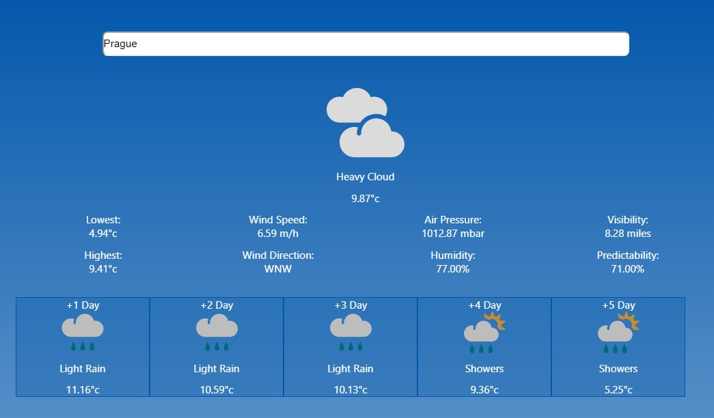

# Weather-App
A test ReactJS application

To run the server, cd into its directory and run the following:
```
npm i
npm start
```

And to run the client, cd into its directory and run the same command:
```
npm i
npm start
```



